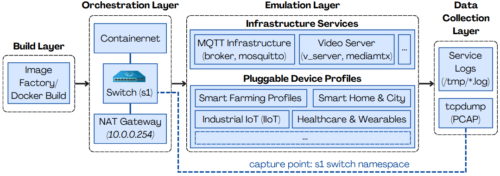

# 🛡️ IoT-Zoo

 


IoT-Zoo is a container-based framework for reproducible IoT traffic emulation. It uses Docker containers as heterogeneous IoT device profiles inside a Containernet/Mininet topology, generating MQTT and RTSP traffic that can be captured as PCAP and later converted for analysis.

The project is designed to support reproducible experiments with heterogeneous IoT profiles, including smart city, industrial, smart building, smart agriculture, healthcare, human-centric monitoring, and CCTV/video traffic.

<p align="center">
  
</p>

## Main features

- Heterogeneous IoT device profiles implemented as Docker containers.
- Containernet/Mininet-based emulation with a central virtual switch.
- MQTT telemetry and RTSP/video traffic generation.
- PCAP capture at the virtual switch level.
- Basic demo mode generated from compressed datasets already included in the repository.
- Full topology mode using all available profiles and datasets.
- Scripts for installation, environment checking, image building, demo execution, and full execution.

## Supported environment

The recommended and tested environments are:

```text
- Ubuntu Server 20.04 LTS
- Ubuntu Server 22.04 LTS
```
Other Linux distributions or Ubuntu versions may work, but they are not officially validated.

IoT-Zoo depends on Linux network namespaces, Docker, Open vSwitch, Containernet/Mininet, privileged network operations, and packet capture. For this reason, Windows, macOS, and WSL/WSL2 are not supported as native execution environments. Use a Linux VM when working from Windows or macOS.

Recommended resources:

| Scenario | vCPU | RAM | Disk |
|---|---:|---:|---:|
| Basic demo | 2+ | 4 GB+ | 20 GB+ |
| Full topology | 4+ | 8 GB+ | 40–50 GB+ |

If you use another operating system, you must provide compatible versions of:
- Docker Engine;
- Open vSwitch;
- Containernet/Mininet;
- Python 3.8+;
- `tcpdump`;
- `tshark`, if PCAP-to-CSV conversion is needed;
- `xz-utils`;
- Linux networking support for namespaces, virtual Ethernet pairs, bridges, and privileged packet capture.

See [`docs/SYSTEM_REQUIREMENTS.md`](docs/SYSTEM_REQUIREMENTS.md) for details.

## Quick start on Ubuntu Server 20.04/22.04 LTS

Use this path on a clean VM or machine.

```bash
git clone <repository-url>
cd <repository-name>

chmod +x scripts/*.sh
chmod +x build_images.sh

./scripts/install_ubuntu.sh
```

After installation, reboot the VM (```sudo reboot```) if the script adds your user to the Docker group. Then run:

```bash
./scripts/check_environment.sh
```

## Basic demo: 2 devices
Use the basic demo as the first validation step. It runs a small scenario with the MQTT broker and two device profiles, using CSV samples generated from the compressed `.csv.xz` datasets already stored in the repository. The original datasets are not modified.
```bash
./scripts/prepare_demo_data.sh --duration 120 --clean
./scripts/build_images.sh --demo
./scripts/run_demo.sh --time 120 --output /tmp/iot_zoo_basic_demo.pcap
```
Check the generated capture:

```bash
ls -lh /tmp/iot_zoo_basic_demo.pcap
tcpdump -r /tmp/iot_zoo_basic_demo.pcap -n port 1883 -c 10
```


## Running the full topology

The full topology uses all available device profiles and the datasets stored under each `devices/<profile>/` folder. Most datasets are kept compressed as `.csv.xz` to reduce repository size.

```bash
./scripts/check_environment.sh
./scripts/build_images.sh --full
./scripts/run_full.sh --time 600 --output /tmp/iot_zoo_full.pcap
```

## Repository structure

```text
.
├── README.md
├── run_experiment.py              # Full topology orchestrator
├── demo_experiment.py             # Basic demo topology orchestrator
├── build_images.sh                # Compatibility wrapper for scripts/build_images.sh
├── architecture.png               # Architecture figure
├── ARCHITECTURE.md                # Architecture overview
├── DEVICE_PROFILES.md             # Device profile documentation
├── scripts/
│   ├── check_environment.sh       # Diagnose the host environment
│   ├── install_ubuntu.sh          # Install dependencies on Ubuntu Server
│   ├── prepare_demo_data.sh       # Generate small demo data from .csv.xz files
│   ├── prepare_demo_data.py       # Demo data sampler
│   ├── build_images.sh            # Build demo or full Docker images
│   ├── run_demo.sh                # Run a small end-to-end demo
│   └── run_full.sh                # Run the full topology
├── docs/
│   ├── INSTALL_UBUNTU.md
│   ├── SYSTEM_REQUIREMENTS.md
│   ├── DATASETS.md
│   ├── TROUBLESHOOTING.md
│   └── VM_GUIDE.md
├── sample_data/
│   └── urban_observatory/         # Generated small demo data
├── devices/                       # Device profile source code, Dockerfiles, and datasets
└── convert_pcap_to_csv/           # PCAP-to-CSV conversion utilities
```

## Scripts

| Script | Purpose |
|---|---|
| `scripts/install_ubuntu.sh` | Installs system and Python dependencies on Ubuntu Server. |
| `scripts/check_environment.sh` | Checks OS, Docker, Open vSwitch, Python packages, Containernet, project paths, datasets, and demo images. |
| `scripts/prepare_demo_data.sh` | Generates a small demo dataset from the full `.csv.xz` files. |
| `scripts/build_images.sh --demo` | Builds only the images needed by the basic demo. |
| `scripts/build_images.sh --full` | Builds all available device images. |
| `scripts/run_demo.sh` | Runs the basic demo scenario and writes a PCAP file. |
| `scripts/run_full.sh` | Runs the full IoT-Zoo topology and writes a PCAP file. |

## Dataset organization

Datasets are stored with the device profiles that use them.

Most profiles follow this pattern:

```text
devices/<profile_name>/
├── Dockerfile
├── <profile_source_code>.py
└── <dataset-file-or-folder>.csv.xz
```

For example:

```text
devices/air_quality/air_quality/AirQualityUCI.csv.xz
```

The Urban Observatory profile is the main exception. It contains multiple domain folders and multiple compressed datasets:

```text
devices/urban_observatory/
├── air_quality/
│   ├── 2025-CO.csv.xz
│   ├── 2025-NO.csv.xz
│   └── 2025-NO2.csv.xz
├── building/
├── weather/
├── water/
└── urban_sensor.py
```

The basic demo does not duplicate the full datasets. Instead, it generates small CSV samples under `sample_data/urban_observatory/` using:

```bash
./scripts/prepare_demo_data.sh --duration 120 --clean
```

See [`docs/DATASETS.md`](docs/DATASETS.md) for details.

## Output files

Typical outputs include:

- `.pcap`: network capture generated by `tcpdump`;
- `/tmp/*.log`: service and device logs generated during execution;
- `.csv`: optional processed output generated by `convert_pcap_to_csv/`.

Saving PCAP files to `/tmp` is recommended because packet capture runs with elevated privileges.

## PCAP-to-CSV conversion

After generating a PCAP file, use the converter in `convert_pcap_to_csv/`:

```bash
cd convert_pcap_to_csv/
python3 main.py --input /tmp/iot_zoo_basic_demo.pcap --output iot_zoo_basic_demo.csv
```

If you used `scripts/install_ubuntu.sh`, these dependencies are already installed. Otherwise, install them manually:

```bash
sudo apt-get install -y tshark
pip3 install pandas scapy scikit-learn
```

See [`convert_pcap_to_csv/README.md`](convert_pcap_to_csv/README.md) for feature definitions and extraction details.

## Security note

IoT-Zoo creates privileged network namespaces, Docker containers, virtual links, Open vSwitch bridges, and packet capture processes. Run it inside a dedicated VM when possible. The included scenarios are intended to generate local emulated traffic only.

The artifact does not execute attacks against external hosts, real IoT devices, production networks, or cloud services. Generated traffic is confined to the local Containernet/Mininet topology.

## Troubleshooting

Start with:

```bash
./scripts/check_environment.sh
```

Common issues and fixes are documented in [`docs/TROUBLESHOOTING.md`](docs/TROUBLESHOOTING.md).

## Citation

If you use IoT-Zoo in your research, please cite:

```bibtex
@inproceedings{quincozes2026iotzoo,
  author    = {Quincozes, Vagner E. and Kreutz, Diego and Quincozes, Silvio E.},
  title     = {IoT-Zoo: A Container-Based Framework for Heterogeneous IoT Device Profiles and Reproducible Traffic Capture},
  booktitle = {Simp{\'o}sio Brasileiro de Redes de Computadores e Sistemas Distribu{\'i}dos (SBRC)},
  publisher = {SBC},
  year      = {2026},
  pages     = {94--104}
}
```

Reference:

> QUINCOZES, Vagner E.; KREUTZ, Diego; QUINCOZES, Silvio E. IoT-Zoo: A Container-Based Framework for Heterogeneous IoT Device Profiles and Reproducible Traffic Capture. In: Simpósio Brasileiro de Redes de Computadores e Sistemas Distribuídos (SBRC). SBC, 2026. p. 94-104.

## License

***Copyright (c) [2026] [RNP – REDE NACIONAL DE ENSINO E PESQUISA]***

Este código foi desenvolvido pelo GT-IoTEdu e está licenciado sob os termos da Licença BSD. Ele pode ser livremente utilizado, modificado e distribuído, inclusive para fins comerciais, desde que este aviso de direitos autorais seja mantido.

Este software é fornecido “como está”, sem qualquer garantia, expressa ou implícita, incluindo, sem limitação, garantias de comercialização ou adequação a um propósito específico. A RNP e os autores não se responsabilizam por quaisquer danos ou prejuízos decorrentes do uso deste software.
